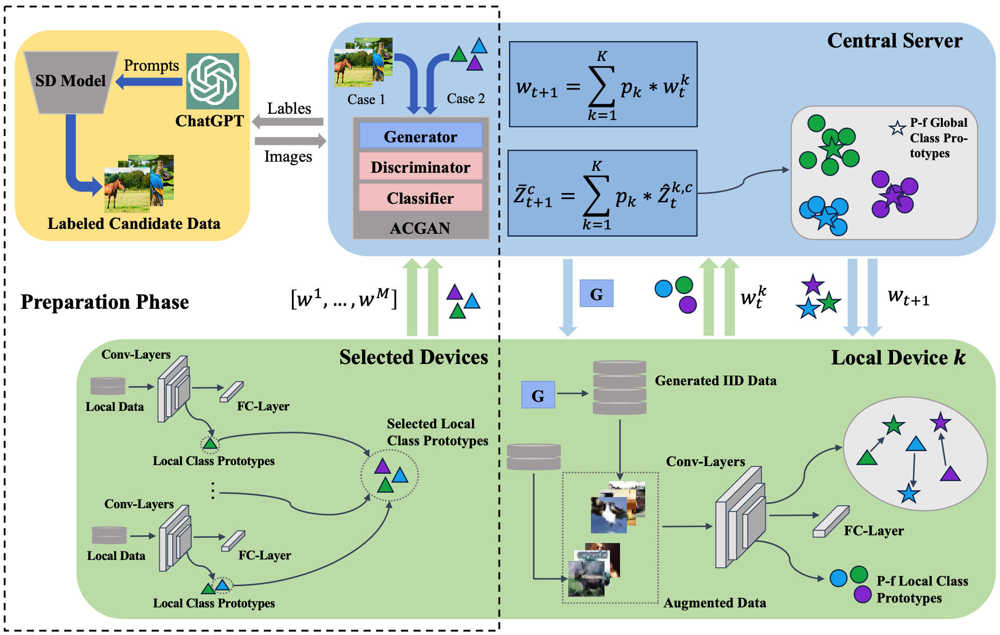

# SlaugFL: Efficient Edge Federated Learning With Selective GAN-Based Data Augmentation

This is the pytorch implementation code of the paper "[SlaugFL: Efficient Edge Federated Learning with Selective GAN-based Data Augmentation](https://ieeexplore.ieee.org/abstract/document/10521828)"

## Overview
The following figure shows an overview of our SlaugFL. The SlaugFL consists of two parts. The left part, in the dotted box, is the preparation phase which aims to obtain a trained ACGAN model. The right part shows the process of our FL collaborative training. In the collaborative training phase, we propose a dual-calibration method on the device side to improve FL performance: during the local training phase of selected devices, the local model is calibrated on the augmented data and further corrected through aligning its local class prototypes with the received p-f global class prototypes.



We divide the implementation code into two parts: The Preparation Phase and The Collaborative Training Phase.

## Setup
Install packages in the requirements.

## The Preparation Phase


## The Collaborative Training Phase

1. Change the arguments in config.py
2. Run the following script:
```
python main.py --function=run_job
```

## Citation

If you find this code is useful to your research, please consider to cite our paper.

```
@article{liu2024slaugfl,
  title={SlaugFL: Efficient Edge Federated Learning with Selective GAN-based Data Augmentation},
  author={Liu, Jianqi and Zhao, Zhiwei and Luo, Xiangyang and Li, Pan and Min, Geyong and Li, Huiyong},
  journal={IEEE Transactions on Mobile Computing},
  year={2024},
  publisher={IEEE}
}
```

## Reference code
1. FedLab: https://github.com/SMILELab-FL/FedLab
2. FedGen: https://github.com/zhuangdizhu/FedGen